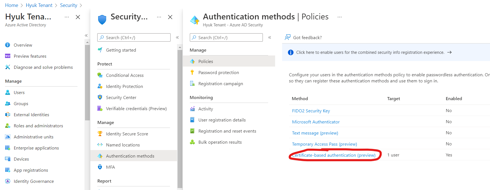
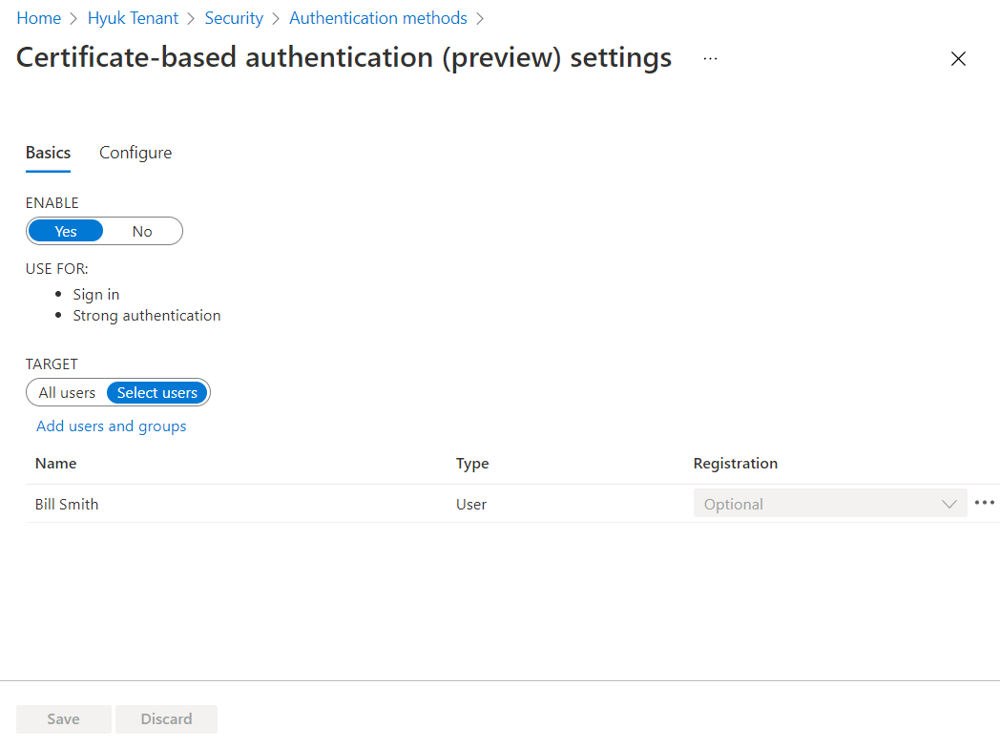
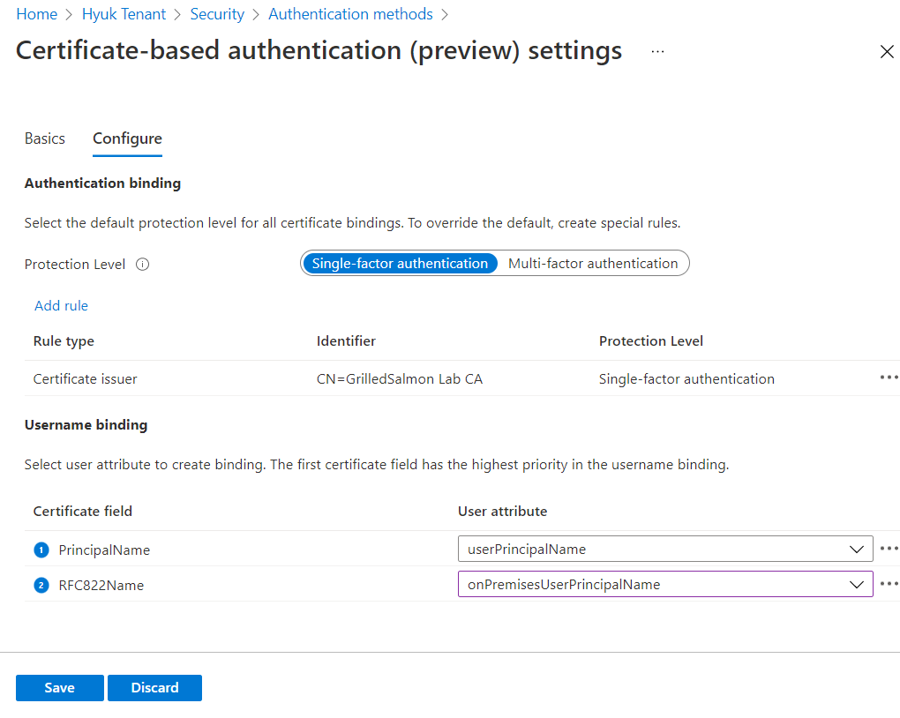

# Azure AD Certificate-Based Authentication Demo


Azure AD CBA enables users to sign-in with client certificate instead of entering user password without deploying ADFS servers. (Before AAD CBA feature is supported, companies who wants to use client certificate had to deploy ADFS.)

Azure AD CBA gives following benefits.
 - Meet regulatory compliance (e.g government org) which requires certificate based authenticaion
 - Gives better use experience which doesn't require entering password especially on mobile device
 - No need to deploy additional infrastructure for ADFS. It is Azure AD native feature.

https://docs.microsoft.com/en-us/azure/active-directory/authentication/concept-certificate-based-authentication


Below is steps to test AAD CBA feature using PowerShell on Windows machine. (Configuring CRL distribution is skipped in this demo for simplicity.)

### 1. Create Root certificate (on Windows)

```powershell
# Create a Self Signed Certificate
PS C:\> $rootcert = New-SelfSignedCertificate -CertStoreLocation cert:\CurrentUser\My -DnsName "GrilledSalmon Lab CA" -KeyUsage CertSign
PS C:\> Write-host "Certificate Thumbprint: $($rootcert.Thumbprint)"
Certificate Thumbprint: AB810378CF62324940815A65CC6D39FF203AFFCD

# Export the certficate as a cer file
PS C:\>Export-Certificate -Cert $rootcert -FilePath C:\grilledsalmon.cer

```

### 2. Upload the root certificate to Azure AD

```powershell
# Install AzureAD PowerShell Module
PS C:\> Install-Module -Name AzureAD

# Login in to your Azure AD tenant
PS C:\> Connect-AzureAD -tenantid {enter-tenant-id-here}

# Check if any Root certificate is already uploaded. 
PS C:\> Get-AzureADTrustedCertificateAuthority

# If not Upload the certificate
PS C:\> $cert=Get-Content -Encoding byte C:\grilledsalmon.cer
PS C:\> $new_ca=New-Object -TypeName Microsoft.Open.AzureAD.Model.CertificateAuthorityInformation
PS C:\> $new_ca.AuthorityType=0 
PS C:\> $new_ca.TrustedCertificate=$cert
PS C:\> New-AzureADTrustedCertificateAuthority -CertificateAuthorityInformation $new_ca


# Imports root certificate to Trusted Publishers (Requires "Run as Administrator")
PS C:\> Import-Certificate -FilePath C:\grilledsalmon.cer -CertStoreLocation Cert:\LocalMachine\Root

```

### 3. Create client certificate 

```powershell
# Get root certificate to sign client certificate 
PS C:\> $rootca = Get-ChildItem cert:\CurrentUser\my | Where-Object {$_.Thumbprint -eq "AB810378CF62324940815A65CC6D39FF203AFFCD"}

PS C:\> New-SelfSignedCertificate -Type Custom -KeySpec Signature `
-Subject "CN=bill.smith.grilledsalmon.ml"  -KeyExportPolicy Exportable `
-HashAlgorithm sha256 -KeyLength 2048 `
-CertStoreLocation "Cert:\CurrentUser\My" `
-Signer $rootca -TextExtension @("2.5.29.37={text}1.3.6.1.5.5.7.3.2", "2.5.29.17={text}upn=bill.smith@grilledsalmon.ml")
```


### 4. Configure AAD CBA

In Azure Portal Go to Azure Active Directory -> Security -> Authentication methods, and select "Certificate-based authentication (preview)"



On "Basics" tab, Select "Yes" in Enable menu and add a user.



On "Configure" tab, Add rule to map protection level to specific certificate. Also configure "Username binding" to map a specific certificate field (e.g. "PrincipalName" in this example) to Azure AD User attribute. 



And then "Save"

### 5. Test AAD CBA using Web Browser

https://docs.microsoft.com/en-us/azure/active-directory/authentication/how-to-certificate-based-authentication#testing-your-certificate


Reference docs

[Azure AD certificate-based authentication technical deep dive (Preview) - Azure Active Directory | Microsoft Docs](https://docs.microsoft.com/en-us/azure/active-directory/authentication/concept-certificate-based-authentication-technical-deep-dive)

[Limitations with Azure AD certificate-based authentication without federation - Azure Active Directory | Microsoft Docs](https://docs.microsoft.com/en-us/azure/active-directory/authentication/concept-certificate-based-authentication-limitations)

https://docs.microsoft.com/en-us/powershell/module/pki/new-selfsignedcertificate?view=windowsserver2022-ps

https://docs.microsoft.com/en-us/azure/vpn-gateway/vpn-gateway-certificates-point-to-site#clientcert

[Use Powershell to generate certificates for your lab (systemcenterdudes.com)](https://systemcenterdudes.com/powershell-generate-certificates-lab/)

[(5) 개발 환경 구성: 565. PowerShell - New-SelfSignedCertificate를 사용해 CA 인증서 생성 및 인증서 서명 방법 (sysnet.pe.kr)](https://www.sysnet.pe.kr/2/0/12588)


